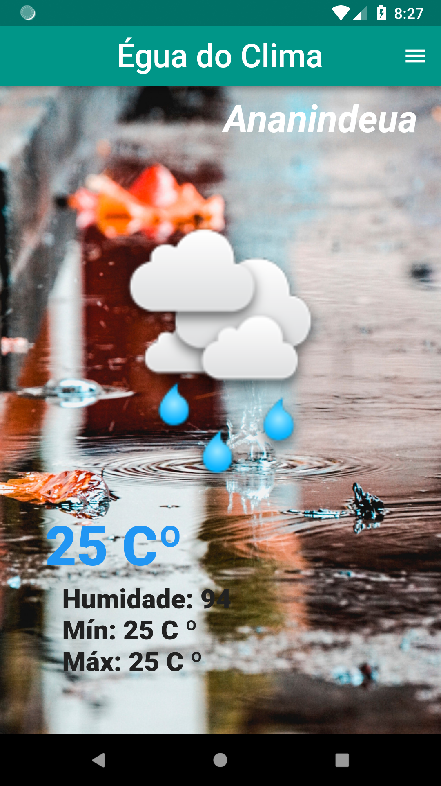
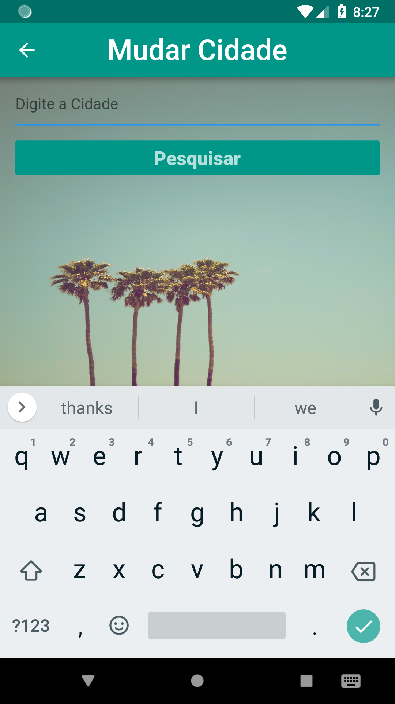
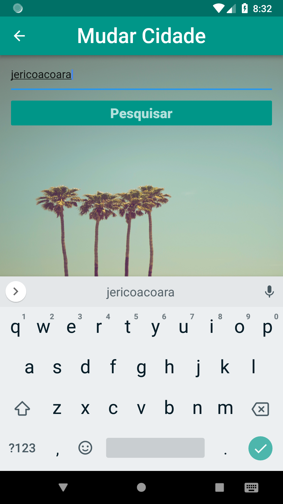
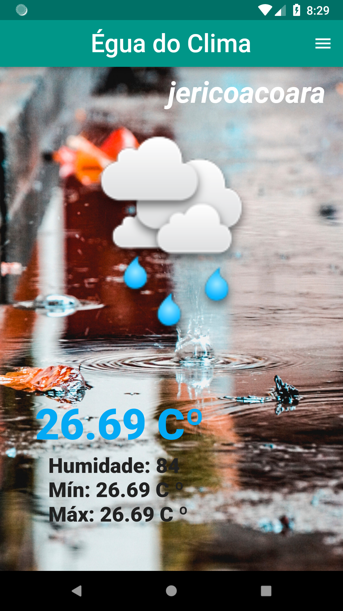

# eguaDoClima (Égua do Clima)
App para checar o clima nas cidade ao redor do mundo.

WARNING: O app se encontra em processo de desenvolvimento.

SCREENSHOTS:

 &nbsp;  &nbsp; 
 &nbsp;  &nbsp; 

TECNOLOGIAS UTILIZADAS NO DESENVOLVIMENTO: 
Flutter Framework (https://flutter.dev/)

FEATURES:

Concluído:
- Implementação da API Open Weather Map banco de dados SQFlite (https://openweathermap.org/current)
- Pagina para a escolha da cidade
- Implementação do DrawerHeader (https://docs.flutter.io/flutter/material/DrawerHeader-class.html)
- Separação entre página principal e secundária com navegação por Material Page Route(https://docs.flutter.io/flutter/material/MaterialPageRoute-class.html)

Em Andamento:
- Autenticação com o google services
- Troca automática da imagem de funco de acordo com o clima (ensolarado, chuvoso)
- Alerta de chuva
- Local authentication com sensor de impressão digital (https://pub.dartlang.org/packages/local_auth)

